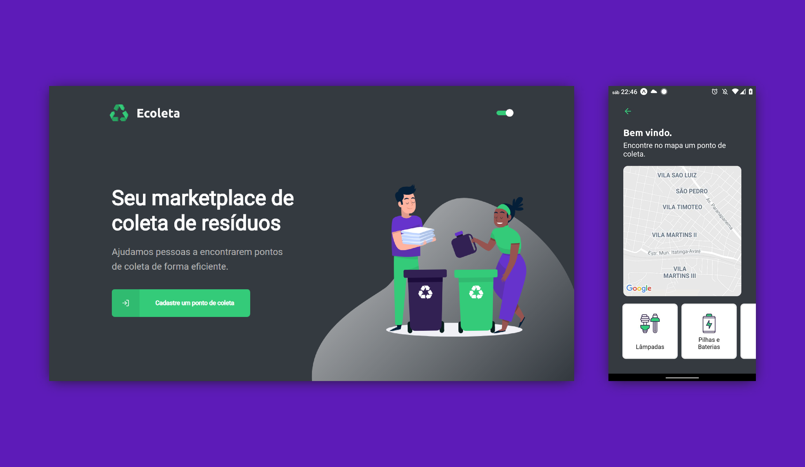

<h1 align="center"> ♻️ Ecoleta </h1>

## :computer: - Projeto

O Ecoleta é um projeto criado para ajudar pessoas a encontrarem pontos de coleta de resíduos para reciclagem

## :rocket: - Tecnologias
Desenvolvido com:

- [Node.js](https://nodejs.org/en/)
- [React](https://reactjs.org/)
- [React Native](https://reactnative.dev/)
- [Expo](https://expo.io/)

## 	:pencil: - Add
Adicionei mais algumas funções:

- Dark Mode Web e Mobile
- Modal de cadastro concluído e erro
- Mascará de telefone
